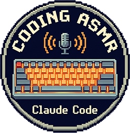

# Coding ASMR

<p align="center">
  
</p>

Handmade sound effects for Claude Code. Every tool call gets a pleasant, calming oldschool clicking and typing sound — as if Claude is sitting next to you, typing away.

Paste this into your AI coding assistant to install:

```bash
git clone https://github.com/artmerenfeld/coding-asmr.git && cd coding-asmr && npm run install-hooks
```

Requires [FFmpeg](https://ffmpeg.org/) (`winget install FFmpeg` / `brew install ffmpeg` / `apt install ffmpeg`). Restart your Claude Code session after.

---

Typing clicks loop while Claude writes code, scanner sounds hum while it reads files, a soft thinking sound plays when it's pondering your prompt, and a completion chime plays when it's done. All sounds are handmade recordings — keyboard clicks, mechanical spacebar thunks, scanner hums, thinking murmurs, question chimes, and completion jingles.

## What It Sounds Like

```
You submit a prompt
  → thinking murmur

Claude reads a file
  → click → scanner loop fades in
  → click

Claude edits code
  → click → typing clicks loop
  → click → typing clicks resume

Claude runs a command
  → click → typing clicks loop
  → click → typing clicks resume

Claude asks you a question
  → question chime

Claude marks a task done
  → check jingle

Claude finishes responding
  → typing stops → completion chime
```

Every sound is async — nothing blocks the AI. One-shots play over ongoing loops. Loops have a 0.3s minimum duration so they're always audible. Variants rotate so you don't hear the same click twice in a row.

## Install

### 1. Install FFmpeg

- Windows: `winget install FFmpeg`
- macOS: `brew install ffmpeg`
- Linux: `apt install ffmpeg`

### 2. Clone and install

```bash
git clone https://github.com/artmerenfeld/coding-asmr.git
cd coding-asmr
npm run install-hooks
```

The installer checks for `ffplay` and will tell you if it's missing.

### 3. Restart Claude Code

Hooks load at session start, so **start a new session** to hear sounds.

## Controls

```bash
npm run off                # Mute everything + stop loops
npm run on                 # Re-enable sounds
npm run volume -- 30       # Set volume (0-100)
npm run status             # Show what's enabled
npm run stop               # Emergency: kill stuck loops
npm run uninstall          # Remove hooks + clean up
npm run install-hooks      # Reinstall hooks
```

Or use the CLI directly: `node cli.js off`, `node cli.js volume 30`, etc.

## Uninstall

```bash
npm run uninstall
```

Removes only Coding ASMR hooks (other plugins are preserved), stops all loops, and cleans up temp files. Restart your Claude Code session after.

## Sounds

### Loops

Only one loop plays at a time. Starting a new one kills the old one. Loops have a 0.3s minimum duration so quick tool calls don't cut them off instantly. Scanner loop fades in smoothly.

| Sound | Files | When |
|-------|-------|------|
| Typing | `typing.wav` | While Claude writes code or runs commands |
| Scanner | `readloop1.wav`, `readloop2.wav` | While reading/searching files (fades in) |

Loops start at a random offset so they don't sound identical each time.

### One-Shots

| Sound | Files | When |
|-------|-------|------|
| Click | `click1.wav` — `click6.wav` | Every tool start and finish |
| Check | `check1.wav` — `check3.wav` | Task marked done or Claude finishes |
| Spacebar | `spacebar1.wav`, `spacebar2.wav` | Session starts |
| Thinking | `thinking1.wav` — `thinking17.wav` | You submit a prompt (40% volume) |
| Question | `question1.wav` — `question13.wav` | Claude asks you something (40% volume) |
| Error | `error.wav` | Tool failure |
| Notification | `notification.wav` | Needs attention |
| Compact | `compact.wav` | Context compaction |

One-shots play over ongoing loops — they don't interrupt them. They have a 0.5s hard cooldown and a 1s variant cooldown (picks a different variant instead of repeating).

### Hook Flow

| Event | Loop | One-Shot |
|-------|------|----------|
| `SessionStart` | — | spacebar |
| `UserPromptSubmit` | — | thinking |
| `PreToolUse` | — | click |
| `PreToolUse` (Read/Grep/Glob) | Start scanner | — |
| `PreToolUse` (Write/Edit/Bash) | Start typing | — |
| `PreToolUse` (AskUserQuestion) | — | question |
| `PostToolUse` | — | click |
| `PostToolUse` (Write/Edit/Bash) | Start typing | — |
| `PostToolUse` (TodoWrite) | — | check |
| `PostToolUseFailure` | Start typing | error |
| `Stop` | Stop | check |
| `Notification` | — | notification |
| `PreCompact` | Stop | click + compact |

## Configuration

Edit `config.json`:

```json
{
  "enabled": true,
  "volume": 35,
  "sounds": {
    "session-start": { "enabled": true },
    "click":         { "enabled": true },
    "check":         { "enabled": true },
    "error":         { "enabled": true },
    "notification":  { "enabled": true },
    "typing-loop":   { "enabled": true },
    "readloop":      { "enabled": true },
    "compact":       { "enabled": true },
    "thinking":      { "enabled": true },
    "question":      { "enabled": true }
  }
}
```

Volume is 0–100. Disable individual sounds or set top-level `"enabled": false` to mute everything.

## Guardrails

- **Cooldown**: Same sound can't fire within 0.5s. Within 1s, a different variant plays.
- **Single loop**: Only one ambient loop at a time. Starting a new one kills the old one.
- **Min duration**: Loops play for at least 0.3s before they can be replaced.
- **Fade-in**: Scanner loop fades in over 0.1s for a smoother feel.
- **Overlay**: One-shots (click, check, thinking, question) play over ongoing loops without interrupting them.
- **Lockfile**: Parallel hooks are serialized to prevent race conditions.
- **Orphan cleanup**: On stop, sweeps for any ffplay processes playing our sounds.
- **PID + timestamp**: Stale loops are detected and force-killed.
- **Hook merging**: Install/uninstall only touches Coding ASMR hooks, preserving other plugins.

## Project Structure

```
coding-asmr/
├── cli.js                       # Control panel (on/off/volume/install/uninstall)
├── handler.js                   # One-shot sounds with cooldown + random variants
├── config.json                  # Volume + per-sound toggles
├── setup.js                     # Regenerates synth WAV files
│
├── core/                        # Sound engine (zero dependencies)
│   ├── synth.js                 # WAV synthesis from math
│   ├── sounds.js                # Synth recipes (error, notification, compact)
│   ├── player.js                # Cross-platform: ffplay / afplay / paplay
│   ├── config.js                # Config loader
│   └── index.js                 # Public API
│
├── scripts/
│   ├── ambient.js               # Loop manager (lockfile + PID tracking)
│   ├── install-hooks.js         # Installs hooks (merges, doesn't overwrite)
│   ├── test-sound.js            # Test individual sounds
│   └── test-all.js              # Test all sounds
│
├── sounds/
│   ├── error.wav                # Synth: harsh buzz
│   ├── notification.wav         # Synth: bright ping
│   ├── compact.wav              # Synth: whoosh
│   └── handmade/                # Real recordings
│       ├── click{1-6}.wav       # 6 keyboard click variants
│       ├── typing.wav           # 30s typing loop
│       ├── readloop{1,2}.wav    # 2 scanner loops (10s each)
│       ├── check{1-3}.wav       # 3 completion sounds
│       ├── spacebar{1,2}.wav    # 2 spacebar thunks
│       ├── thinking{1-17}.wav   # 17 thinking murmur variants
│       └── question{1-13}.wav   # 13 question chime variants
│
├── hooks/hooks.json             # Hook definitions (portable)
├── .claude-plugin/plugin.json   # Plugin manifest
└── marketplace.json             # Marketplace manifest
```

## Requirements

- **Node.js** >= 18
- **ffplay** (from FFmpeg) — the installer checks for this

## License

MIT
